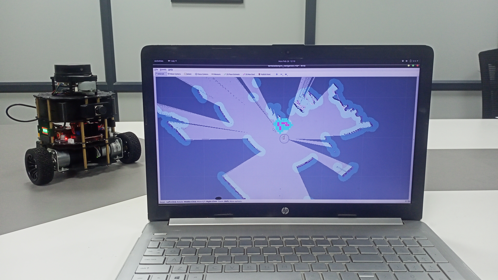

# Tortoisebot Pro
## ROS1 Noetic Release


<div align="center">

Welcome to the official public repository for **TortoisebotPro** by **RigBetel Labs**.

**Purpose:**  
This repository hosts essential documentation and code for *TortoisebotPro Robot*, facilitating transparency and collaboration.

**Privacy:**  
Certain sensitive packages and scripts have been excluded to maintain privacy standards.

**Contents:**  
- **Documentation:** Detailed guides and technical specifications.
- **Codebase:** Essential source code for *TortoisebotPro Robot*.
- **Resources:** Supplementary materials and dependencies.


**Contact:**  
For inquiries and collaboration opportunities, reach out to RigBetel Labs.


<a href="https://rigbetellabs.com/"></a>
<a href="https://www.youtube.com/channel/UCfIX89y8OvDIbEFZAAciHEA"></a>
<a href="https://www.instagram.com/rigbetellabs/"></a>


</div>

<details open="open">
  <summary>Table of Contents</summary>
<ol>
    <li><a href="#1-installation">Installation</a>
    </li>
    <li><a href="#2-connection">Connection</a>
    </li>
    <li><a href="#3-package-description">Package Description</a>
        <ol>
            <li><a href="#31-tortoisebotpro_control">tortoisebotpro_control</a>
            </li>
            <li><a href="#32-tortoisebotpro_description">tortoisebotpro_description</a>
            </li>
            <li><a href="#33-tortoisebotpro_firmware">tortoisebotpro_firmware</a>
            </li>
            <li><a href="#34-tortoisebotpro_gazebo">tortoisebotpro_gazebo</a>
            </li>
            <li><a href="#35-tortoisebotpro_navigation">tortoisebotpro_navigation</a>
            </li>
            <li><a href="#36-tortoisebotpro_odometry">tortoisebotpro_odometry</a>
            </li>
            <li><a href="#37-tortoisebotpro_slam">tortoisebotpro_slam</a>
            </li>
            <li><a href="#38-installsh">install.sh</a></li>
        </ol>
    </li>
    <li><a href="#4-launch-sequence">Launch Sequence</a>
    <ol>
        <li><a href="#41-gazebo-simulation">Gazebo Simulation</a></li>
            <ol>
                <li><a href="#411-map-generation">Map Generation</a></li>
                <li><a href="#412-autonomous-navigation-in-the-saved-map">Autonomous Navigation in the saved map</a></li>
                <li><a href="#413-slam">SLAM</a></li>
            </ol>
        <li><a href="#42-actual-robot">Actual Robot</a></li>
            <ol>
                <li><a href="#421-map-generation">Map Generation</a></li>
                <li><a href="#422-autonomous-navigation-in-the-saved-map">Autonomous Navigation in the saved map</a></li>
                <li><a href="#423-slam">SLAM</a></li>
            </ol>
     </ol>
    </li>
        <li><a href="#5-general-robot-information">General Robot Information</a>
        <ol>
            <li><a href="#51-topic-description">Topic Description</a></li>
            <li><a href="#52-battery">Battery</a></li>
            <li><a href="#53-robot-velocities">Robot Velocities</a></li>
            <li><a href="#54-usb-ports">USB Ports</a></li>
        </ol>
    </li>
</ol>
</details>


## 1. Installation

Clone the repository into your workspace,

```py
cd ~/catkin_ws/src # Assuming catkin_ws is the name of the workspace
git clone https://github.com/rigbetellabs/tortoisebot_pro.git
```

Build the workspace,
```py
cd ~/catkin_ws/
catkin_make
```

Installation of dependent packages,
```py
cd ~/catkin_ws/src/tortoisebot_pro
cat requirements.txt | xargs sudo apt-get install -y 
# This installs all the packages mentioned in the requirements.txt
```

> [!NOTE]
> Check if you already have the lidar packages installed; if not, get the packages from repos below.

```py
cd ~/catkin_ws/src/
git clone https://github.com/YDLIDAR/ydlidar_ros_driver.git
```

## 2. Connection

Wifi Setup?

To start any operation within the robot we need to SSH into and then perform operations. 

> [!NOTE]
> After switching the robot ON the Computing device takes a minute or so to boot up, wait for a while and then SSH into the robot using the below credentials.

```py
ssh "your-robot-name"@"your-robot-ip"
```

> [!NOTE]
> Please refer the robot for `robot_name` and the login password.
> Verify the IP that gets assigned to the robot via your network manager.

If you do not want to recheck if robot is connected to the network now or then you can utilize the `connect_tortoisebotpro.sh` script.

```py
./connect_tortoisebotpro.sh "username" "robot-ip"
```

The scripts scan the local network you are connected to and initiates a SSH connection if the robot is connected, the process continues until the robot is connected.

Successful execution looks something like this.

<p align="center">
	
</p>

## 3. Package Description

> [!IMPORTANT]
> We have tested mapping and navigation using Gmapping and Cartographer, Cartographer has some inherent flaws hence we prefer to use Gmapping over Cartographer. Launch files for cartographer are provided for you to experiment. Description for these launch files are provided but the launch sequence for these lauch file has not been added.

### 3.1 [tortoisebotpro_control](https://github.com/rigbetellabs/tortoisebot_pro/blob/master/tortoisebotpro_control/)

To manually control the robot.

<table>
    <thead>
        <tr>
            <th>File</th>
            <th>Description</th>
            <th>Nodes Launched</th>
        </tr>
    </thead>
    <tbody>
        <tr>
            <td><a href="https://github.com/rigbetellabs/tortoisebot_pro/blob/master/tortoisebotpro_control/launch/tortoisebotpro_teleop_joy.launch">tortoisebotpro_teleop_joy.launch</a>
            </td>
            <td>Manually control the robot using Xbox controller.</td>
            <td>
                   <code>/joy_node</code>,
                    <code>/teleop_twist_joy</code> from <code>tortoisebotpro_control</code>
                    </td>
        </tr>
        <tr>
            <td><a href="https://github.com/rigbetellabs/tortoisebot_pro/blob/master/tortoisebotpro_control/src/tortoisebot_teleop_key.py">tortoisebot_teleop_key.py</a></td>
            <td>Modified version of <code>teleop_twist_keyboard</code> from <code>teleop_twist_keyboard</code>.</td>
            <td><code>/teleop_twist_keyboard</code></td>
        </tr>
        <tr>
            <td><a href="https://github.com/rigbetellabs/tortoisebot_pro/blob/master/tortoisebotpro_control/src/tortoisebotpro_teleop_joy.cpp">tortoisebotpro_teleop_joy.cpp</a></td>
            <td>Custom remapping from <code>joy</code> to <code>cmd_vel</code> for controlling the robot using an Xbox controller.</td>
            <td><code>/teleop_joy</code></td>
        </tr>
    </tbody>
</table>

### 3.2 [tortoisebotpro_description](https://github.com/rigbetellabs/tortoisebot_pro/blob/master/tortoisebotpro_description/)

Holds the robot description including `urdf`, `stl`, config files for `rviz` and `gazebo`

<table>
    <thead>
        <tr>
            <th>File</th>
            <th>Description</th>
            <th>Nodes Launched</th>
        </tr>
    </thead>
    <tbody>
        <tr>
            <td><a href="https://github.com/rigbetellabs/tortoisebot_pro/blob/master/tortoisebotpro_description/launch/display.launch">display.launch</a></td>
            <td>Visualize the URDF of the robot in RVIZ.</td>
            <td>
                   <code>/rviz</code>, <code>/robot_state_publisher</code>,
                    <code>/joint_state_publisher</code>
                    </td>
        </tr>
        <tr>
            <td><a href="https://github.com/rigbetellabs/tortoisebot_pro/blob/master/tortoisebotpro_description/launch/gazebo.launch">gazebo.launch</a></td>
            <td>Visualize the Robot in an empty world within Gazebo.</td>
            <td>
                   <code>/gazebo</code>, <code>/robot_state_publisher</code>
            </td>
        </tr>
        <tr>
            <td><a href="https://github.com/rigbetellabs/tortoisebot_pro/blob/master/tortoisebotpro_description/launch/rviz.launch">rviz.launch</a></td>
            <td>Just RVIZ, useful to visualize while mapping or navigation.</td>
            <td>
                <code>/rviz</code>
            </td>
        </tr>
    </tbody>
</table>


### 3.3 [tortoisebotpro_firmware](https://github.com/rigbetellabs/tortoisebot_pro/blob/master/tortoisebotpro_firmware/)

As the name suggest get all the sensor and actuation topics available to you
<table>
    <thead>
        <tr>
            <th>File</th>
            <th>Description</th>
            <th>Nodes Launched</th>
        </tr>
    </thead>
    <tbody>
        <tr>
            <td><a href="https://github.com/rigbetellabs/tortoisebot_pro/blob/master/tortoisebotpro_firmware/launch/bringup.launch">bringup.launch</a></td>
            <td>Launches Robot state publishers, serial node for communication with ESP32, Lidar driver, USB can driver.</td>
            <td>
                <code>/robot_state_publisher</code>, <code>/rosout</code>, <code>/serial_node</code>, <code>/usb_cam</code>, <code>/wheel_odom</code>, <code>/ydlidar_node</code>
            </td>
        <!-- </tr>
        <tr>
            <td>server_bringup.launch</td>
            <td>Launches Cartographer node to produce odometry if needed.</td>
            <td>
            Cartographer
            </td>
        </tr> -->
        <tr>
            <td><a href="https://github.com/rigbetellabs/tortoisebot_pro/blob/master/tortoisebotpro_firmware/scripts/fake_landmark.py">fake_landmark.py</a></td>
            <td>Publish fake landmarks to be used by Cartographer.</td>
            <td>
                <code>/landmark_sampler</code>
            </td>
        </tr>
        <tr>
            <td><a href="https://github.com/rigbetellabs/tortoisebot_pro/blob/master/tortoisebotpro_firmware/scripts/odom_pub.py">odom_pub.py</a></td>
            <td>Takes the odom from TF published by Cartographer and publishes it as an individual topic. Only required when used with a real robot.</td>
            <td>
                <code>/odom_publisher</code>
            </td>
        </tr>
        <tr>
            <td><a href="https://github.com/rigbetellabs/tortoisebot_pro/blob/master/tortoisebotpro_firmware/scripts/ticks_to_odom.py">ticks_to_odom.py</a></td>
            <td>Publishes Robot odometry as perceived by wheel encoders.</td>
            <td>
                <code>/wheel_odom</code>
            </td>
        </tr>
        <tr>
            <td><a href="https://github.com/rigbetellabs/tortoisebot_pro/blob/master/tortoisebotpro_firmware/scripts/wavepoints.py">wavepoints.py</a></td>
            <td>Makes robot traverse from one point to another.</td>
            <td>
                <code>/csv_to_goal_publisher</code>
            </td>
        </tr>
    </tbody>
</table>

### 3.4 [tortoisebotpro_gazebo](https://github.com/rigbetellabs/tortoisebot_pro/blob/master/tortoisebotpro_gazebo/)

Simulation environment for tortoisebotpro in Gazebo

<table>
    <thead>
        <tr>
            <th>File</th>
            <th>Description</th>
            <th>Nodes Launched</th>
        </tr>
    </thead>
    <tbody>
        <tr>
            <td><a href="https://github.com/rigbetellabs/tortoisebot_pro/blob/master/tortoisebotpro_gazebo/launch/tortoisebotpro_docking.launch">tortoisebotpro_docking.launch</a></td>
            <td>Docking environment for charging.</td>
            <td><code>/spawn_urdf</code>, <code>/joint_state_publisher</code>, <code>/robot_state_publisher</code>, <code>/gazebo</code></td>
        </tr>
        <tr>
            <td><a href="https://github.com/rigbetellabs/tortoisebot_pro/blob/master/tortoisebotpro_gazebo/launch/tortoisebotpro_empty_world.launch">tortoisebotpro_empty_world.launch</a></td>
            <td>Just an empty world.</td>
            <td><code>/spawn_urdf</code>, <code>/joint_state_publisher</code>, <code>/robot_state_publisher</code>, <code>/gazebo</code></td>
        </tr>
        <tr>
            <td><a href="https://github.com/rigbetellabs/tortoisebot_pro/blob/master/tortoisebotpro_gazebo/launch/tortoisebotpro_playground.launch">tortoisebotpro_playground.launch</a></td>
            <td>Tortoisebot needs a house to live in.</td>
            <td><code>/spawn_urdf</code>, <code>/joint_state_publisher</code>, <code>/robot_state_publisher</code>, <code>/gazebo</code></td>
        </tr>
    </tbody>
</table>

### 3.5 [tortoisebotpro_navigation](https://github.com/rigbetellabs/tortoisebot_pro/blob/master/tortoisebotpro_navigation/)

Autonomous navigation of robot using `move_base` in a know as well as unknown environment

<table>
    <thead>
        <tr>
            <th>File</th>
            <th>Description</th>
            <th>Node Launched</th>
        </tr>
    </thead>
    <tbody>
        <tr>
            <td><a href="https://github.com/rigbetellabs/tortoisebot_pro/blob/master/tortoisebotpro_navigation/launch/amcl.launch">amcl.launch</a></td>
            <td>Let's localize the robot in the environment, not always robot know where it is in the environment.</td>
            <td>
                <code>/amcl</code>
            </td>
        </tr>
        <tr>
            <td><a href="https://github.com/rigbetellabs/tortoisebot_pro/blob/master/tortoisebotpro_navigation/launch/move_base.launch">move_base.launch</a></td>
            <td>The node responsible to get the robot moving from one point to other avoiding dynamic as well as static obstacles.<br>
             Parameters for the move_base can be found in <code>param</code> directory</td>
            <td>
                <code>/move_base</code>
            </td>
        </tr>
        <tr>
            <td><a href="https://github.com/rigbetellabs/tortoisebot_pro/blob/master/tortoisebotpro_navigation/launch/tortoisebotpro_navigation.launch">tortoisebotpro_navigation.launch</a></td>
            <td>Launches <code>move_base</code> along with presaved map or online map generation using 
OR

roslaunch tortoisebotpro_odometry tortoisebotpro_carto_odom.launch/gmapping based upon your preference.<br>
                If parameter <code>exploration</code> with the launch file is set true then the map is provided by the mapping agent - cartographer/gmapping else offline map stored in the <code>map</code> directory of the <code>tortoisebotpro_navigation</code> package is used. Which map you may ask well set the parameter <code>map_file</code> to the map that will be used.<br>
                        To switch mapping agent from gmapping to cartographer while in exploration set <code>using_gmapping</code> param to false. 
            </td>
            <td>
             <code>/slam_gmapping</code>, <code>/cartographer_occupancy_grid_node</code>, <code>/map_server</code>, <code>/rviz</code>, <code>/move_base</code>
            </td>
        </tr>
    </tbody>
</table>


### 3.6 [tortoisebotpro_odometry](https://github.com/rigbetellabs/tortoisebot_pro/blob/master/tortoisebotpro_odometry/)

How will the robot know where it is in the environment? Well it generates its own odometry for the purpose.

<table>
    <thead>
        <tr>
            <th>File</th>
            <th>Description</th>
            <th>Nodes Launched</th>
        </tr>
    </thead>
    <tbody>
        <tr>
            <td><a href="https://github.com/rigbetellabs/tortoisebot_pro/blob/master/tortoisebotpro_odometry/launch/tortoisebotpro_icp_odom.launch">tortoisebotpro_icp_odom.launch</a></td>
            <td>Produces odometry data for the robot using Lidar and IMU.</td>
            <td>
                        <code>/icp_odometry</code>
                        <code>/ekf_localization_node</code>,
                        <code>/alpha_beta_filter</code>
            </td>
        </tr>
            <tr>
            <td><a href="https://github.com/rigbetellabs/tortoisebot_pro/blob/master/tortoisebotpro_odometry/launch/tortoisebotpro_carto_odom.launch">tortoisebotpro_carto_odom.launch</a></td>
            <td>Produces odometry data for the robot using cartographer.</td>
            <td>
                        <code>/cartographer_node</code>
            </td>
        </tr>
        <tr>
            <td><a href="https://github.com/rigbetellabs/tortoisebot_pro/blob/master/tortoisebotpro_odometry/scripts/alpha_beta_filter.py">alpha_beta_filter.py</a></td>
            <td>Alpha beta filter to smoothen out the translation in x and y. Odometry generated is purely based on lidar and IMU. This is how we do it.</td>
            <td>
               <code>/alpha_beta_filter</code>
            </td>
        </tr>
    </tbody>
</table>

<p align="center">
	
</p>

TF of odom is broadcasted by `alpha_beta_filter` for mapping agents.

### 3.7 [tortoisebotpro_slam](https://github.com/rigbetellabs/tortoisebot_pro/blob/master/tortoisebotpro_slam/)

SLAM!

<table>
    <thead>
        <tr>
            <th>File</th>
            <th>Description</th>
            <th>Node Launched</th>
        </tr>
    </thead>
    <tbody>
        <tr>
            <td><a href="https://github.com/rigbetellabs/tortoisebot_pro/blob/master/tortoisebotpro_slam/launch/gmapping.launch">gmapping.launch</a></td>
            <td>To generate the map of the environment using Gmapping. NOTE: Gmapping requires <code>/scan</code> topic as well <code>odom =&gt; base_link</code> transform.<br>
              Parameters for the Gmapping can be found in <code>config</code> directory.</td>
            <td>
                <code>/slam_gmapping</code>
            </td>
        </tr>
        <tr>
            <td><a href="https://github.com/rigbetellabs/tortoisebot_pro/blob/master/tortoisebotpro_slam/launch/cartographer.launch">cartographer.launch</a></td>
            <td>To generate the map of the environment using Cartographer.</td>
            <td>
                <code>/cartographer_node</code>
            </td>
        </tr>
        <tr>
            <td><a href="https://github.com/rigbetellabs/tortoisebot_pro/blob/master/tortoisebotpro_slam/launch/map_saver.launch">map_saver.launch</a></td>
            <td>A map generated should be saved for navigation.</td>
            <td>
                <code>/map_saver</code>
            </td>
        </tr>
    </tbody>
</table>

### 3.8 install.sh

Performs,
<br>
- Installation of udev rules to hardcode the physical USB ports

**We have installed everything for you no need to worry about!**

## 4. Launch Sequence

### 4.1 Gazebo Simulation

#### 4.1.1 Map Generation

```py
roslaunch tortoisebotpro_gazebo tortoisebotpro_docking.launch # To launch Gazebo simulation environment
```

<p align="center">
	
</p>

```py
roslaunch tortoisebotpro_slam gmapping.launch # To generate Map
```

```py
roslaunch tortoisebotpro_description rviz.launch # To visualize the map generated
```

<p align="center">
	
</p>

```py
rosrun tortoisebotpro_control tortoisebot_teleop_key.py # To control the robot using keyboard
```

Save the map after satisfaction,
```py
roslaunch tortoisebotpro_slam map_saver.launch map_name:=your_map  # To save the map
# Change your_map to what ever you want
```

#### 4.1.2 Autonomous Navigation in the saved map

```py
roslaunch tortoisebotpro_gazebo tortoisebotpro_docking.launch # To launch Gazebo simulation environment
```

```py
roslaunch tortoisebotpro_navigation tortoisebotpro_navigation.launch exploration:=false map_file:=docking 
```

<p align="center">
	
</p>

#### 4.1.3 SLAM

```py
roslaunch tortoisebotpro_gazebo tortoisebotpro_docking.launch # To launch Gazebo simulation environment
```

```py
roslaunch tortoisebotpro_navigation tortoisebotpro_navigation.launch exploration:=true
```

<p align="center">
	
</p>

<p align="center">
	
</p>

### 4.2 Actual Robot

> [!NOTE]
> For every command to be executed within the robot a new SSH connection needs to be established.

#### 4.2.1 Map Generation

```py
roslaunch tortoisebotpro_firmware bringup.launch using_joy:=true # Set to true if using Xbox controller to control the robot
```
> [!IMPORTANT]
> The current bringup.launch file looks for YDLidar X4-Pro model to start the scanning, if you have X4 model on your robot, edit the launch file from X4-Pro.launch to X4.launch in bringup.launch

```py
rosrun tortoisebotpro_control tortoisebot_teleop_key.py # If using computer keyboard to control the robot
```

>[!NOTE]
> If you are using XBOX controller to control the robot set the `using_joy` argument within the `bringup.launch` to `true` and donot use `tortoisebot_teleop_key.py` and if `teleop_twist_keyboard` set the `using_joy` argument within the `bringup.launch` to `false` and execute tortoisebot_teleop_key.py

<p align="center">
	
</p>

Config to use the XBOX controller

```py
roslaunch tortoisebotpro_odometry tortoisebotpro_icp_odom.launch # TO generate Odometry
```


```py
roslaunch tortoisebotpro_slam gmapping.launch # To generate Map
```

Save the map after satisfaction,
```py
roslaunch tortoisebotpro_slam map_saver.launch map_name:=your_map 
# Change your_map to what ever you want
```

<p align="center">
	
</p>

#### 4.2.2 Autonomous Navigation in the saved map

```py
roslaunch tortoisebotpro_firmware bringup.launch 
```

```py
roslaunch tortoisebotpro_odometry tortoisebotpro_icp_odom.launch # TO generate Odometry
```

```py
roslaunch tortoisebotpro_navigation tortoisebotpro_navigation.launch exploration:=false map_file:=your_map 
```


<p align="center">
	
</p>


#### 4.2.3 SLAM

```py
roslaunch tortoisebotpro_firmware bringup.launch 
```

```py
roslaunch tortoisebotpro_odometry tortoisebotpro_icp_odom.launch # TO generate Odometry
```

```py
roslaunch tortoisebotpro_navigation tortoisebotpro_navigation.launch exploration:=true
```

<p align="center">
	
</p>

> [!TIP]
> For you to visualize the maps, robot position you will need to connect robot and your computer in a `ROS_MASTER` and `ROS_SLAVE` configuration. Follow the below instructions to do so

Open a terminal editor to edit `.bashrc`

```py
nano ~/.bashrc
```

Paste the below code with right credentials

```py
export ROS_MASTER_URI=http://"your-robot-ip":11311
export ROS_HOSTNAME="your-computer-ip"
```

How to find your computer ip,

```py
hostname -I
```

<p align="center">
	
</p>

And then launch,


```py
roslaunch tortoisebotpro_description rviz.launch # To visualize the map generated
```


## 5. General Robot Information


<table>
    <tr>
        <th>Parameter</th>
        <th>Value</th>
    </tr>
    <tr>
        <td>Wheel Separation Length</td>
        <td>0.195m</td>
    </tr>
    <tr>
        <td>Motor Type</td>
        <td>Planetary DC Geared Motor</td>
    </tr>
    <tr>
        <td>RPM</td>
        <td>110</td>
    </tr>
    <tr>
        <td>Encoder Type</td>
        <td>Magnetic Encoder</td>
    </tr>
    <tr>
        <td>PPR (Pulses Per Revolution)</td>
        <td>420</td>
    </tr>
    <tr>
        <td>Microcontroller</td>
        <td>DOIT-ESP32 Devkit V1</td>
    </tr>
    <tr>
        <td>PC Used</td>
        <td>Intel NUC i3 10th Gen</td>
    </tr>
    <tr>
        <td>Robot Payload Capacity</td>
        <td>15 kgs</td>
    </tr>
    <tr>
        <td>Battery Life</td>
        <td>About 1.5 hours</td>
    </tr>
    <tr>
        <td>Battery Type</td>
        <td>Lithium-ion 6-cell, 22.2V</td>
    </tr>
</table>

### 5.1 Topic Description

<table>
    <thead>
        <tr>
            <th>Topic</th>
            <th>Description</th>
        </tr>
    </thead>
    <tbody>
        <tr>
            <td><code>/bat_per</code></td>
            <td>Battery percentage remaining until complete discharge</td>
        </tr>
        <tr>
            <td><code>/bat_voltage</code></td>
            <td>Battery voltage</td>
        </tr>
        <tr>
            <td><code>/cmd_vel</code></td>
            <td>Command velocity for the robot</td>
        </tr>
        <tr>
            <td><code>/diagnostics</code></td>
            <td>Diagnostics messages</td>
        </tr>
        <tr>
            <td><code>/heading</code></td>
            <td>Robot heading based on magnetometer</td>
        </tr>
        <tr>
            <td><code>/imu/data</code></td>
            <td>IMU data including orientation, rotational velocities and linear acceleration</td>
        </tr>
        <tr>
            <td><code>/wheel/ticks</code></td>
            <td>Encoder reading of wheels in an array of the format of [left, right]</td>
        </tr>
        <tr>
            <td><code>/wheel/vel</code></td>
            <td>Wheel velocities in an array of the format of [left, right]</td>
        </tr>
        <tr>
            <td><code>/odom</code></td>
            <td>Odometry generated from wheel encoders</td>
        </tr>
        <tr>
            <td><code>/pid/constants</code></td>
            <td>Set PID constants</td>
        </tr>
        <tr>
            <td><code>/pid/control</code></td>
            <td>Should PID be used or not</td>
        </tr>
        <tr>
            <td><code>/scan</code></td>
            <td>Lidar measurements</td>
        </tr>
        <tr>
            <td><code>/usb_cam</code></td>
            <td>Cascaded topics providing complete information about the camera</td>
        </tr>
        <tr>
            <td><code>/diagnostics/test</code></td>
            <td>Run diagnostics on the robot</td>
        </tr>
    </tbody>
</table>

### 5.2 Battery

Within the robot a buzzer beeps to indicate the status of battery.

<table>
    <thead>
    <tr>
        <th>Battery Level</th>
        <th>Beeps Status</th>
    </tr>
    </thead>
    <tbody>
    <tr>
        <td>100 % to 20 %</td>
        <td>No beeps</td>
    </tr>
    <tr>
        <td>20 % to 15 %</td>
        <td>Beeps after every 2 mins</td>
    </tr>
    <tr>
        <td>15 % to 10 %</td>
        <td>Beeps after every 1 min</td>
    </tr>
    <tr>
        <td>10 % to 0 %</td>
        <td>Continuous Beeps</td>
    </tr>
</table>


> [!CAUTION]
> Do not drain the battery below `10 %`, doing so will damage the battery permanently.
> Maximum battery voltage is 25.2V and minimum usable battery voltage is 19.8V

A battery is made available on the robot which indicate the status of the battery so that you don't have to `echo` on topics. Every bar on the indicator indicates 25% battery health. So,

<table>
    <thead>
    <tr>
        <th>Bar Level</th>
        <th>Battery Level</th>
    </tr>
    </thead>
    <tbody>
    <tr>
        <td>1</td>
        <td>0 % to 25 %</td>
    </tr>
    <tr>
        <td>2</td>
        <td>25 % to 50 %</td>
    </tr>
    <tr>
        <td>3</td>
        <td>50 % to 75 %</td>
    </tr>
    <tr>
        <td>4</td>
        <td>75 % to 100 %</td>
    </tr>
</table>

<p align="center">
	
</p>


### 5.3 Robot Velocities

Maximum Linear Velocity  - <code>0.37 m s<sup>-1<sup></code>
<br>
Maximum Angular Velocity  - <code>3.836 rad s<sup>-1<sup></code>

### 5.4 USB Ports

A strict rule needs to be followed while connecting Lidar, ESP32 and USB camera. These ports are hardcoded and devices needs to be connected as depicted below.

<p align="center">
	
</p>

<p align="center">
	
</p>